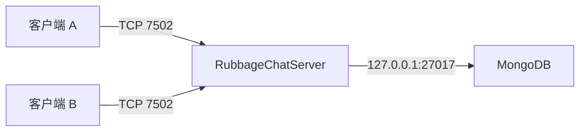

# RubbageChat 构建、部署与公网通信

RubbageChat 是 Qt 6/QML 客户端、Qt Network 服务端和 MongoDB 业务库组成的中心式聊天系统。客户端不保存账号、好友或消息数据库；服务端验证会话令牌并把用户、好友申请、好友关系、会话选项、消息和附件写入 MongoDB。

## 本机要求

- Qt `6.11.0` MinGW 64 位：`D:\Qt\6.11.0\mingw_64`
- MinGW：`D:\Qt\Tools\mingw1310_64`
- MongoDB 8.x，默认监听 `127.0.0.1:27017`
- 可选：7-Zip，用于生成安装包

项目使用 qmake：

```powershell
cd D:\gptwork\RubbageChat
.\Build-RubbageChat.ps1
```

可运行文件和 Qt 动态库统一生成到 `deploy`。测试也必须从该目录运行：

```powershell
.\deploy\RubbageChatProtocolSmokeTest.exe
```

## 启动本机版本

```powershell
.\Start-RubbageChat.ps1
```

启动器会检查 `27017`。如果 MongoDB 尚未运行，它会从 `PATH`、`RUBBAGECHAT_MONGOD_PATH` 或当前开发机的默认安装位置寻找 `mongod.exe`，并使用 `%LOCALAPPDATA%\RubbageChat\mongodb` 作为数据目录。MongoDB 是共享基础服务，因此关闭 RubbageChat 时不会自动终止它。

服务端配置位于 `deploy\rubbagechat.ini`：

```ini
[network]
host=127.0.0.1
chatPort=7502
filePort=7028

[database]
mongoUri=mongodb://127.0.0.1:27017/?serverSelectionTimeoutMS=3000
name=rubbagechat

[security]
tls=false
certificateFile=
privateKeyFile=
```

当前统一协议只使用 TCP `7502`；`filePort` 为旧配置兼容项。附件随鉴权消息上传，限制为 6 MB，并在 MongoDB `attachments` 集合保存内容、摘要和元数据。

内置测试账号：

- `100000001` / `rubbagechat`
- `100000002` / `rubbagechat`

首次启动时服务端会创建这些账号。正式环境应删除或修改演示账号。

## 数据集合

- `users`：账号、资料、PBKDF2-SHA256 密码摘要和随机盐
- `sessions`：随机会话令牌的 SHA-256 摘要和过期时间
- `friend_requests`：好友申请及处理状态
- `friendships`：规范化的双向好友关系
- `conversation_options`：置顶、免打扰和当前用户的历史隐藏点
- `messages`：文本/文件消息、客户端幂等 ID、已读状态和时间
- `attachments`：文件内容、文件名、MIME、大小和 SHA-256

服务端以令牌解析发送者，忽略客户端提交的 `sender` 字段；只有好友可以读取历史、发消息或上传文件。消息写入 MongoDB 成功后才返回确认并向在线接收者推送事件。离线用户重新登录后直接读取同一份持久化历史。

## 两台客户端通信

两台客户端都连接同一个 RubbageChatServer：



局域网测试时，在服务端电脑的防火墙中仅放行 TCP `7502`，客户端在“设置 → 网络”填写服务端局域网 IP。

## 公网部署

1. 在云主机安装 MongoDB，让它只监听 `127.0.0.1`，不要暴露 `27017`。
2. 上传 `deploy\RubbageChatServer.exe` 及同目录的 Qt/MinGW 运行库。
3. 配置 `rubbagechat.ini` 的 Mongo URI 和监听端口。
4. 云防火墙仅开放应用入口 `7502`。
5. 两个客户端把服务器地址改为云主机域名或 IP、端口 `7502`。

直接把裸 TCP `7502` 暴露到互联网只适合联调。正式上线把 `security/tls` 设为 `true`，并填写 PEM 证书和 RSA 私钥路径；客户端使用同一配置后会验证证书链和域名，校验失败时主动断开，代码不会忽略 SSL 错误。也可把流量置于可信 VPN/零信任网络内。MongoDB 端口始终只允许服务端访问。

环境变量可覆盖配置：

```powershell
$env:RUBBAGECHAT_SERVER_HOST='chat.example.com'
$env:RUBBAGECHAT_CHAT_PORT='7502'
$env:RUBBAGECHAT_MONGO_URI='mongodb://127.0.0.1:27017/?serverSelectionTimeoutMS=3000'
$env:RUBBAGECHAT_MONGO_DATABASE='rubbagechat'
```

## 安装包

```powershell
.\Build-RubbageChat.ps1
.\Build-Installer.ps1
```

输出为 `dist\RubbageChatSetup.exe`。客户端电脑如果连接公网服务器，不需要安装 MongoDB；只有运行本地服务端的电脑需要 MongoDB。
