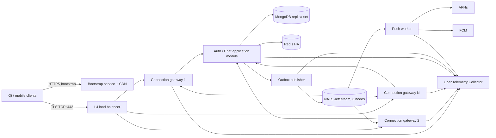

# RubbageChat 商业级即时通信产品化研究

> 调研日期：2026-07-30  
> 适用基线：当前 Qt 6/QML + `QTcpSocket`/`QSslSocket` + TCP/JSON + MongoDB 实现  
> 资料范围：只采用项目源码、官方文档、正式规范和官方源码仓库

## 1. 结论先行

RubbageChat 不需要让用户配置服务器 IP。正式产品应把一个稳定的 HTTPS 域名固化在客户端，例如 `https://config.rubbage.chat/v1/bootstrap`，启动时获取当前 TCP/TLS 入口、备用入口、最低客户端版本和功能开关；解析失败时依次使用“本地缓存的最后一次有效配置”和“安装包内置的备用域名”。客户端始终连接域名并校验证书，不连接裸 IP，也不提供普通用户可见的服务器设置。

适合本项目的演进路线不是立即拆成很多微服务，而是：

1. 先把现有单进程改成 **无状态长连接网关 + MongoDB 副本集 + Redis**。网关后放四层 TCP 负载均衡，任何一次重连都可进入任一实例。
2. 消息写入采用 **MongoDB 事务性 outbox**：消息和待发布事件在同一事务提交；确认持久化成功后才向发送端返回“已接收”。后台发布器把 outbox 事件送入 **NATS JetStream**，网关和推送服务按至少一次语义消费，所有消费者按 `messageId` 幂等。
3. MongoDB 是消息与同步游标的事实来源；JetStream 是可靠事件分发层；Redis 只承载在线状态、网关路由、限流和短缓存。不要用 Redis Pub/Sub 承担可靠消息投递，因为其官方语义是至多一次，订阅者断线时消息永久丢失。
4. 第一阶段选 **NATS JetStream**，不选 Kafka。它把持久流、确认、重投、去重和 3/5 节点 RAFT 集群集成在 NATS Server 中，适合当前规模和团队。只有当需要长期事件日志、多个数据平台消费者、成熟 Kafka 生态或经压测确认 JetStream 不满足目标时，再引入 Kafka。
5. 不承诺网络层“恰好一次”。产品协议采用“**至少一次传输 + 全链路幂等 + 每会话有序序号 + 游标补拉**”，这是能够在超时、重连和进程崩溃下正确工作的模型。
6. 端到端加密不要自行设计密码协议。若把隐私作为卖点，应单独立项，优先评估 Matrix 的 Olm/Megolm 实现或 Signal 的 X3DH/Double Ratchet/Sesame 体系；在多设备、密钥验证、备份、群聊和设备丢失方案完成前，不应宣称端到端加密。

## 2. 当前实现的能力边界

根据仓库中的 [ARCHITECTURE.md](../ARCHITECTURE.md)、[ChatServer.cpp](../apps/server/network/ChatServer.cpp)、[MongoChatStore.cpp](../apps/server/storage/MongoChatStore.cpp) 和 [ChatController.cpp](../apps/client/application/ChatController.cpp)，当前系统已有一些正确基础：

- TCP 长连接、长度前缀 JSON 帧、TLS 1.2+、证书错误即断开；
- `requestId` 请求关联、断线重连、心跳、连接和请求限流；
- 服务端权威身份，Token 摘要落库；
- 消息写入 MongoDB 后才响应，已使用 `clientMessageId` 唯一索引处理重复发送；
- 在线事件推送，离线后从 MongoDB 历史恢复。

但它仍是邀请测试架构，不是商业运行架构：

- 客户端从 INI/本地设置读取 host/port，公网包只是把配置锁定，并没有可动态更新的 bootstrap；
- 一个 `ChatServer` 实例同时承担连接、鉴权、业务分派、在线路由和同步 MongoDB 调用；数据库慢查询会阻塞同一事件循环中的其他连接；
- 在线状态、限流桶、账号到 Socket 的映射只存在单进程内，多实例互相不可见；
- 消息写库后直接向本实例 Socket 推送，没有 outbox；进程若在提交数据库后、推送前崩溃，实时事件会丢失；
- `clientMessageId` 当前是全局唯一，更合理的幂等边界是 `{senderDeviceId, clientMessageId}`，且命中重复记录时必须再次校验所有权；
- 历史按 `createdAt` 排序。时间戳不能表达严格会话顺序，两个并发发送可能同毫秒，客户端也无法用稳定游标精确补拉；
- `read: bool` 混合了“消息是否被某账号读过”的状态，无法支持多设备、群聊和每设备同步；
- 附件 Base64 穿过聊天协议并保存在 MongoDB，会占用网关内存、数据库容量和复制带宽；
- 没有跨实例链路追踪、标准指标、告警、容量模型、自动故障转移和灾难恢复演练。

## 3. 客户端免配 IP：推荐方案

### 3.1 推荐的连接发现流程

客户端只内置以下不可变信息：

- bootstrap URL：`https://config.rubbage.chat/v1/bootstrap`
- 备用 bootstrap URL：不同 DNS/托管故障域下的地址
- 产品环境标识和 bootstrap 响应 schema 版本

启动流程：

1. 用 `QNetworkAccessManager` 请求 bootstrap HTTPS URL，设置 3–5 秒超时、响应大小上限，正常校验证书。
2. 成功后校验 schema、过期时间、允许的协议和域名后原子保存为 last-known-good 配置。
3. 连接 `endpoints` 中优先级最高的 **域名**；对同优先级入口做抖动或权重选择，失败后指数退避并切换备用入口。
4. bootstrap 暂时不可用时使用未超过硬性最长有效期的本地缓存；缓存也不可用时使用安装包内置的聊天备用域名。
5. 通过 `QSslSocket::connectToHostEncrypted(host, port)` 建立 TLS，保持 Qt 默认的对端证书校验；禁止静默调用 `ignoreSslErrors()`。
6. 登录后服务端仍可返回“建议重新 bootstrap”的控制事件，以便迁移机房，但客户端只能从受信 HTTPS bootstrap 获取新地址，不能盲信聊天帧中的任意主机名。

示例响应：

```json
{
  "schemaVersion": 1,
  "environment": "prod",
  "expiresAt": "2026-07-31T12:00:00Z",
  "minClientVersion": "1.4.0",
  "protocolVersions": [2],
  "endpoints": [
    {
      "host": "chat-cn1.rubbage.chat",
      "port": 443,
      "transport": "tls-tcp",
      "priority": 10,
      "weight": 100
    },
    {
      "host": "chat-cn2.rubbage.chat",
      "port": 443,
      "transport": "tls-tcp",
      "priority": 20,
      "weight": 100
    }
  ],
  "features": {
    "registration": true,
    "fileUploadV2": true
  }
}
```

这与 Matrix 正式规范使用 `https://hostname/.well-known/...` 返回委托服务器、遵循重定向、正常做 X.509 校验并缓存结果的发现模式相同；可直接借鉴其失败缓存和最大缓存时长思路。[Matrix Server Discovery](https://spec.matrix.org/latest/server-server-api/#server-discovery)

### 3.2 DNS、SRV 和 HTTPS bootstrap 的分工

- `chat.rubbage.chat` 的 A/AAAA 记录指向四层负载均衡，而不是某台应用服务器。改 IP 只更新 DNS，安装包无需更新。
- HTTPS bootstrap 负责表达 DNS 不适合表达的产品信息：协议版本、最低客户端版本、多区域优先级、灰度和功能开关。
- DNS SRV 可作为第二种发现/灾备手段。SRV 正式定义了服务的目标、端口、优先级和权重；Qt 提供 `QDnsLookup::SRV` 与 `QDnsServiceRecord`。[RFC 2782](https://www.rfc-editor.org/rfc/rfc2782)、[Qt QDnsLookup](https://doc.qt.io/qt-6/qdnslookup.html)、[Qt QDnsServiceRecord](https://doc.qt.io/qt-6/qdnsservicerecord.html)
- 只用 SRV 不足以承载版本和灰度策略，也更容易受本地 DNS 环境影响，因此它不应替代 HTTPS bootstrap。
- A/AAAA 返回多个地址时应考虑 IPv4/IPv6 并发尝试，避免坏掉的单一地址族拖慢连接；IETF 的 Happy Eyeballs v2 专门定义了这类连接策略。[RFC 8305](https://www.rfc-editor.org/rfc/rfc8305)

### 3.3 TLS 取舍

首期保持当前 `QSslSocket` 端到端到网关的 TLS 最简单。`connectToHostEncrypted()` 会先解析域名、建立 TCP，再执行握手；无法验证对端身份时若不忽略错误，连接会被丢弃。[Qt QSslSocket](https://doc.qt.io/qt-6/qsslsocket.html)

生产入口统一使用 443 可提高在企业网、酒店网络和移动网络中的可达性。四层负载均衡做 TLS passthrough 时，网关持有证书；若在负载均衡器终止 TLS，则负载均衡器到网关还需私网 TLS/mTLS，且必须正确传递真实客户端地址。证书轮换必须自动化，不把证书或公钥指纹永久写死在普通配置文件中。

## 4. 目标架构



这张图表示逻辑职责，不要求第一天就部署六种独立二进制。首期可以把 Auth/Chat 与 outbox publisher 作为同一服务中的深模块，但必须把连接状态、业务写入、事件发布接口分开，使它们以后能独立扩容。

## 5. 长连接网关水平扩展

### 5.1 网关职责

网关只负责：

- TLS、帧解析、协议版本协商；
- 连接生命周期、心跳、反压和每连接队列上限；
- Token 验证结果缓存、请求转发；
- 本机 `connectionId -> socket` 映射；
- 从消息总线收到事件后投递到本机设备；
- 连接数、发送队列、网络错误和延迟指标。

网关不应直接执行耗时 MongoDB 查询，更不应在 Socket 事件循环中同步执行密码派生、附件读写或全量快照。当前 C++ 服务至少应把阻塞工作放入有界工作池；工作池满时快速返回过载，而不是无限排队占光内存。

### 5.2 负载均衡与跨网关路由

NGINX `stream` 模块支持通用 TCP/UDP 代理和上游负载均衡；`least_conn` 会将新连接分配给活动连接最少的上游，适合寿命差异很大的长连接。[NGINX stream upstream](https://nginx.org/en/docs/stream/ngx_stream_upstream_module.html)

每条已建立的 TCP 连接在其生命周期内天然固定到一个网关，但产品**不依赖重连粘性**。网关实例必须无持久会话状态；客户端重连任意实例后用 device token 恢复身份，再按同步游标补齐缺口。

在线注册建议：

```text
presence:{userId}:{deviceId}
  -> {gatewayId, connectionId, lastSeenAt}
TTL = 90 seconds, heartbeat renews
```

若某个收件设备在线，事件通过 JetStream/NATS subject 到达网关消费层；网关只投递属于本实例的活动连接。Redis 用于快速判断设备是否在线和位于哪个网关，但 Redis 记录过期或误判不会造成消息丢失，因为客户端仍从 MongoDB 按游标同步。

每实例必须设置：

- 最大连接数、单 IP/账号/设备连接上限；
- 单连接输入帧、每秒请求数和在途请求上限；
- 单连接输出队列字节上限和慢消费者断开策略；
- 全局有界线程池和数据库连接池；
- 优雅下线：停止接收新连接，通知客户端带随机延迟重连，等待短暂排空后退出；
- 负载均衡健康检查与 readiness：MongoDB/消息总线完全不可用时不再接新流量。

## 6. 消息可靠性模型

### 6.1 明确定义三个确认

| 状态 | 含义 | 何时产生 |
|---|---|---|
| `accepted` | 服务端已持久化消息，可在故障后恢复 | MongoDB 的消息和 outbox 以 majority 成功提交 |
| `delivered` | 某个收件设备已收到并持久化到本地状态 | 设备向服务端确认 `messageId` 或连续游标 |
| `read` | 用户在某个设备上实际阅读 | 客户端显式上报 read cursor |

APNs/FCM 接受请求、网关 `socket.write()` 成功或 Broker ACK 都不能当作最终 `delivered`。发送端 UI 应分别显示“发送中、已发送、已送达、已读、失败/重试”，不要用一个布尔值表示全部状态。

### 6.2 写入与投递流程

1. 客户端为每次用户发送生成稳定的 `clientMessageId`，断线重试必须复用它。
2. 服务端验证身份和会话成员关系。
3. 在 MongoDB 事务中：
   - 以原子计数为该 `conversationId` 分配递增 `seq`；
   - 插入消息；
   - 插入 outbox 事件。
4. 使用 `writeConcern: "majority"` 提交成功后返回 `accepted(messageId, seq, serverTime)`。
5. outbox publisher 持续读取未发布事件，发布到 JetStream，使用 `messageId` 作为 `Nats-Msg-Id`，收到 Broker ACK 后标记 outbox 已发布。
6. 网关消费者按至少一次语义处理；重复事件用 `messageId` 去重，然后向在线设备发送。
7. 客户端按 `(conversationId, seq)` 幂等落本地缓存，发现序号缺口时调用 `sync?afterSeq=...`。
8. 离线或推送失败不影响正确性；重新连接时以服务端同步接口补拉。

JetStream 的基础服务质量是至少一次：发布 ACK 或消费 ACK 丢失时可能重发；其 `Nats-Msg-Id` 只在配置的滑动窗口内去重，所以应用数据库的唯一约束仍然必须存在。[NATS JetStream](https://docs.nats.io/nats-concepts/jetstream)、[JetStream model deep dive](https://docs.nats.io/using-nats/developer/develop_jetstream/model_deep_dive)

### 6.3 排序、幂等和离线同步

- 只保证**每个会话内**的服务端顺序，不追求全局顺序。
- `seq` 是服务端权威顺序；`createdAt` 仅用于展示和审计。
- 消息唯一键建议为 `{senderDeviceId, clientMessageId}`；服务端返回重复结果前要校验 sender、conversation 和 payload 摘要一致，否则返回幂等键冲突。
- Broker 的分区/subject 键固定为 `conversationId`。若未来用 Kafka，同一 key 会进入同一 partition，Kafka 只保证 topic-partition 内消费者按写入顺序读取。[Apache Kafka introduction](https://kafka.apache.org/documentation/#intro_concepts_and_terms)
- 消费者提交 ACK 前必须完成自身副作用；崩溃导致重投时以 `eventId`/`messageId` 幂等。
- 同步 API 使用不透明 cursor 或 `(conversationId, afterSeq, limit)`，响应包含 `hasMore` 和 `nextCursor`。会话列表也要有账号级 `syncSeq`，避免每次登录全量扫描全部好友与历史。
- 已送达/已读采用每账号或每设备的连续游标，例如 `lastDeliveredSeq`、`lastReadSeq`，而不是逐消息布尔更新。
- 服务端应给消息状态定义单调规则，重复或倒退的 ACK 不改变状态。

## 7. NATS JetStream、Kafka 与 Redis 的明确取舍

| 方案 | 官方语义/能力 | 本项目取舍 |
|---|---|---|
| NATS Core | 至多一次、最佳努力 | 只可用于可丢失控制信号，不承载消息可靠投递 |
| NATS JetStream | 持久流、发布 ACK、至少一次消费者、显式 ACK、重投、滑窗去重、RAFT 集群 | **首选**；3 个 JetStream 节点、文件存储、stream replicas=3、pull durable consumer |
| Apache Kafka | 同 key 同 partition 有序；幂等 producer 要求 `acks=all`、重试和受限的 in-flight；支持事务 | 暂不引入；当事件保留、数据管道和消费生态成为主要需求时评估 |
| Redis Pub/Sub | 官方明确为至多一次，断线即丢 | 禁止用于可靠聊天消息 |
| Redis Streams | 持久 append-only log、consumer group、ACK 和 pending；但默认异步复制在故障切换时仍可能缺数据 | 可做小型任务流，但既然选择 JetStream，不再承担第二套可靠总线 |

NATS 官方建议在需要扩展、流控和错误处理时使用 pull consumer；JetStream 集群使用 RAFT，官方一般推荐 3 或 5 个节点。[NATS Consumers](https://docs.nats.io/nats-concepts/jetstream/consumers)、[JetStream clustering](https://docs.nats.io/running-a-nats-service/configuration/clustering/jetstream_clustering)

Kafka 若将来启用，应显式核查 `enable.idempotence=true`、`acks=all`、`retries>0` 和 `max.in.flight.requests.per.connection<=5`；官方文档说明这些条件可在允许的 in-flight 范围内保持顺序。[Kafka producer configs](https://kafka.apache.org/41/configuration/producer-configs/)

Redis Pub/Sub 与 Streams 的语义差异见 [Redis Pub/Sub](https://redis.io/docs/latest/develop/pubsub/) 和 [Redis Streams](https://redis.io/docs/latest/develop/data-types/streams/)。本项目中 Redis 的职责限定为：

- 在线设备和网关路由（TTL）；
- 分布式限流计数；
- 短期 Token/用户资料缓存及失效通知；
- 短租约/选主辅助，但不持有消息唯一真相；
- 不缓存消息正文或端到端密钥。

## 8. MongoDB：先副本集，后按证据分片

### 8.1 立即需要的生产基线

商业运行前必须从 standalone 升级为 3 个数据节点的 replica set（P-S-S，不用只有一个数据副本的 P-S-A），跨故障域部署：

- 消息、outbox、会话关系等关键写使用 `writeConcern: "majority"` 并设置合理 `wtimeout`；
- 关键同步读使用 primary 或因果一致会话；需要“不读到会回滚的数据”时使用 `readConcern: "majority"`；
- 数据库 URI 列出多个节点和 `replicaSet`，驱动连接池有上限；
- 启用持续备份、时间点恢复、定期恢复演练和索引/慢查询监控。

MongoDB 官方说明，`w:1` 的数据可能在主节点降级前尚未复制而回滚；`majority` 读只返回已被副本集多数确认、不会回滚的数据。[MongoDB Write Concern](https://www.mongodb.com/docs/manual/reference/write-concern/)、[Read Concern majority](https://www.mongodb.com/docs/manual/reference/read-concern-majority/)

事务性 outbox 需要 replica set。MongoDB 多文档事务可让消息、会话序号和 outbox 全部提交或全部回滚，但官方也强调事务有额外成本，不能替代良好模型，因此事务范围必须小、不能包含网络调用。[MongoDB Transactions](https://www.mongodb.com/docs/manual/core/transactions/)

### 8.2 Change Streams 的角色

可以用 MongoDB Change Streams 监听 outbox 插入并唤醒 publisher。每个变更事件都带 resume token，进程重启后可恢复；但恢复依赖 oplog 仍保留对应历史。[MongoDB Change Streams](https://www.mongodb.com/docs/manual/changestreams/)、[Change Stream Events](https://www.mongodb.com/docs/manual/reference/change-events/)

因此：

- resume token 要持久化；
- oplog 保留窗口必须覆盖最长停机时间；
- 即使 token 失效，publisher 仍能扫描 `publishedAt: null` 的 outbox 补偿；
- Change Streams 是低延迟触发器，不是消息真相，也不替代 outbox 状态。

### 8.3 不要过早分片

先通过压测和生产指标确认单副本集的存储、写入或工作集成为瓶颈，再分片。分片前用真实查询样本运行 shard key analyzer；官方要求 shard key 同时考虑高基数、低频热点、非单调增长和常用查询定向性。[Choose a Shard Key](https://www.mongodb.com/docs/manual/core/sharding-choose-a-shard-key/)

消息集合不能直接用单调 `seq` 作片键，否则新写集中到 hot shard。候选方案应以 `conversationId`（或其 hash/bucket）为分布前缀，并确保历史查询带完整 shard key；超大群聊还需按会话和时间桶拆分。最终片键必须由 `analyzeShardKey` 和生产查询分布决定，不能现在拍板。

### 8.4 数据模型建议

```text
messages:
  _id, conversationId, seq, senderUserId, senderDeviceId,
  clientMessageId, type, ciphertext/body, createdAt, editedAt, deletedAt

unique indexes:
  { conversationId: 1, seq: 1 }
  { senderDeviceId: 1, clientMessageId: 1 }

conversation_cursors:
  userId, deviceId?, conversationId, lastDeliveredSeq, lastReadSeq

outbox:
  eventId, aggregateId, type, payload, createdAt, publishedAt, attempts
```

大附件不再 Base64 写入消息帧。改为服务端签发短期上传授权，客户端直传对象存储；消息只保存 object key、大小、MIME、散列和授权元数据。下载同样走短期授权 URL，聊天网关不代理文件字节。

## 9. 可观测性与高并发验证

OpenTelemetry C++ 的 traces、metrics、logs 均为 stable；Collector 能接收、处理、批量、重试、过滤并导出三类信号，避免业务服务绑定某个监控厂商。[OpenTelemetry C++](https://opentelemetry.io/docs/languages/cpp/)、[OpenTelemetry Collector](https://opentelemetry.io/docs/collector/)

所有请求和异步事件携带：

```text
traceId, requestId, eventId, messageId, conversationId,
gatewayId, connectionId, deviceId, protocolVersion
```

日志不得记录密码、Token、完整消息正文、推送 token 或私钥。建议指标：

- `gateway_connections`、连接建立/重连/认证失败率；
- 输入/输出字节、每连接发送队列、慢消费者断开数；
- 请求 p50/p95/p99、线程池/数据库池等待时间；
- MongoDB 写入/事务延迟、write concern 超时、连接池占用；
- outbox backlog 数量和最老年龄；
- JetStream publish ACK 延迟、consumer lag、redelivery、MaxDeliver；
- `message_accept_to_online_delivery_ms`；
- 离线同步缺口大小和完成耗时；
- APNs/FCM 成功、限流、无效 token 和重试；
- bootstrap 成功率、DNS/TLS/连接各阶段失败率。

OpenTelemetry 的 messaging semantic conventions 已定义 `messaging.message.id`、`messaging.message.conversation_id`、consumer group、destination 和 send/process 等通用属性，可用于串起“客户端请求 → MongoDB → outbox → Broker → 网关/推送”。[OTel Messaging Spans](https://opentelemetry.io/docs/specs/semconv/messaging/messaging-spans/)

上线容量结论必须来自压测，而不是“Qt 能承载多少连接”的估算。至少执行：

- 连接风暴：预期峰值 2 倍客户端在 5 分钟内重连，带随机退避；
- 稳态连接：目标在线数保持 24 小时，测内存/连接、心跳和句柄泄漏；
- 热点会话、均匀私聊、群消息 fan-out 三种负载；
- MongoDB 主节点切换、JetStream 节点故障、Redis 故障、网关滚动重启；
- outbox publisher 停机后恢复，验证无丢失且重复不影响业务；
- 慢客户端、恶意大帧、请求洪泛和附件上传隔离。

建议先建立可验证 SLO：

- 月可用性目标；
- 消息 `accepted` p99；
- 在线投递 p99；
- 离线恢复成功率；
- 持久化消息丢失目标为 0；
- 重复消息对用户可见目标为 0；
- RPO/RTO 及备份恢复演练频率。

## 10. APNs / FCM：只作唤醒与提醒

未来移动端注册每个设备的 APNs/FCM token/FID，token 由独立 push worker 使用并可轮换/失效。聊天正文仍以服务端同步为准：

- app 前台且长连接在线：只走实时网关；
- app 后台/离线：outbox 事件触发 push worker；
- 推送 payload 默认只带 `conversationId`、模糊摘要或“有新消息”，点击后连接服务端同步；
- 端到端加密模式不得把明文消息交给推送供应商；
- 用 collapse id/key 合并“请同步”类通知，真正每条都重要的业务事件不要错误折叠；
- 无效 token 立即停用，429/5xx 按供应商建议退避。

Apple 官方明确 APNs 是 best-effort，可能重排、节流、存储或不投递；`apns-collapse-id` 可合并通知，所以 APNs 不能成为送达证明。[Sending notification requests to APNs](https://developer.apple.com/documentation/usernotifications/sending-notification-requests-to-apns)

APNs token 鉴权可供多个 provider server 使用，适合 push worker 水平扩展；签名密钥必须保密和轮换。[APNs token-based connection](https://developer.apple.com/documentation/usernotifications/establishing-a-token-based-connection-to-apns)

FCM 接受后返回 message ID 也不等于设备已经收到；TTL 和 collapse key 会影响存储与替换行为。[FCM message lifespan](https://firebase.google.com/docs/cloud-messaging/customize-messages/setting-message-lifespan)、[FCM collapsible messages](https://firebase.google.com/docs/cloud-messaging/customize-messages/collapsible-message-types)

## 11. 端到端加密取舍

TLS 只能保护传输链路；当前服务端和 MongoDB 能看到消息正文，不是端到端加密。

### 路线 A：先不做 E2EE

适合先完成商业稳定性。明确对外描述为“TLS 传输加密 + 服务端存储加密/访问控制”，不要使用“端到端加密”字样。优先补齐审计、权限、删除、备份和密钥管理。

### 路线 B：采用成熟协议体系

- Signal 的 X3DH 面向收件人离线时的异步密钥协商；Double Ratchet 为每条消息派生新密钥并提供前向安全/失陷后恢复属性；Sesame 处理异步多设备会话。[X3DH](https://signal.org/docs/specifications/x3dh/)、[Double Ratchet](https://signal.org/docs/specifications/doubleratchet/)、[Sesame](https://signal.org/docs/specifications/sesame/)
- Signal 官方 `libsignal` 实现核心协议，但其公开平台 API 主要面向 Java、Swift、TypeScript，底层为 Rust；当前纯 Qt/C++ 接入需要维护 Rust/C ABI 或改变客户端集成方式，成本不低。[signalapp/libsignal](https://github.com/signalapp/libsignal)
- Matrix 的客户端实现指南覆盖每设备身份键/一次性键、Olm 点对点会话、Megolm 群聊、设备验证、密钥分享、轮换、重放防护和加密附件，产品功能面更接近通用聊天软件。[Matrix E2EE implementation guide](https://matrix.org/docs/matrix-concepts/end-to-end-encryption/)

本项目建议先做独立技术验证，再选择：

- 若核心是私聊和高隐私品牌：评估 Signal 协议体系；
- 若优先群聊、多设备、密钥备份/恢复和较完整开放规范：评估 Matrix 的 Olm/Megolm；
- 不从规范复制几段算法后自行实现。必须复用维护中的实现、做第三方安全审计，并设计安全号码/二维码验证、设备增删、密钥变更提示、丢失设备、备份恢复、举报与合规之间的产品规则。

E2EE 会改变服务端能力：全文搜索、内容审核、消息摘要推送、服务端转码和找回历史都需要重新设计，这不是给现有 `body` 字段加一次 AES 加密。

## 12. 成熟聊天产品仍需补齐的能力

架构稳定之外，建议按用户价值补齐：

1. **消息基础**：稳定本地缓存、分页与增量同步、发送状态、回复、转发、编辑、撤回、表情回应、草稿、@、可靠附件。
2. **多设备**：设备列表、远程退出、各设备同步游标、会话/设置同步、冲突处理。
3. **会话**：群聊、成员角色与权限、邀请链接、置顶/静音/归档、搜索、未读数准确性。
4. **实时体验**：输入中、在线/最后上线时间、弱网提示、断点续传、图片缩略图；这些临时状态要可丢失且限频。
5. **通知**：每会话策略、免打扰、跨设备去重、移动推送。
6. **安全与治理**：封禁/拉黑/举报、滥用风控、账号恢复、2FA/Passkey、管理后台、审计日志、数据导出/删除和隐私保留策略。
7. **商业运行**：灰度发布、强制最低版本、自动更新、崩溃报告、状态页、客服工具、备份恢复、值班告警、容量与成本报表。

“简洁流畅”应成为约束而不是缺功能的同义词：高级能力默认不打扰，主界面继续只突出会话、消息和发送；复杂设置按需展开。流畅度要用启动时间、输入响应、滚动帧率、内存、弱网恢复和消息延迟指标持续守住。

## 13. 分阶段落地顺序

### P0：公网正式入口

- 固定 bootstrap HTTPS 域名，隐藏普通用户的 IP/端口配置；
- 443 TLS、A/AAAA、证书自动轮换、last-known-good 和备用域名；
- 协议增加 `deviceId`、`clientMessageId`、`messageId`、`conversationId`、`seq` 和 cursor；
- 修正历史分页与幂等唯一键；
- 建立基本 OTel 指标、结构化日志、压测脚本和 SLO。

### P1：可靠单集群

- MongoDB 3 数据节点 replica set、majority 和备份恢复；
- 消息 + outbox 小事务；
- NATS JetStream 3 节点、replicas=3、durable pull consumers；
- Redis HA 承载 presence、gateway route 和分布式限流；
- 阻塞数据库工作移出 Socket 事件循环；
- 附件直传对象存储。

### P2：网关横向扩展

- 四层负载均衡 `least_conn`；
- 至少 2 个连接网关、无状态鉴权恢复、跨实例投递；
- 优雅下线、慢消费者反压、故障注入和滚动发布；
- 账号级/会话级增量同步与多设备游标。

### P3：标准产品能力

- 群聊、消息编辑/撤回/回复/回应、搜索和多设备管理；
- APNs/FCM push worker；
- 风控、举报、管理后台、审计、数据生命周期和客服能力；
- 灰度、自动更新、崩溃分析、生产告警和容量预测。

### P4：规模或隐私驱动的专项

- 指标证明需要时再做 MongoDB sharding；
- 数据平台和长期事件生态需要时再评估 Kafka；
- 完整产品/密钥恢复设计与安全审计完成后再发布 E2EE。

## 14. 不建议现在做的事情

- 不让客户端保存或输入公网 IP；
- 不把 Redis Pub/Sub 当消息可靠通道；
- 不把在线网关推送当离线消息唯一来源；
- 不用 `createdAt` 代替会话序号；
- 不在返回 `accepted` 之前先发实时事件；
- 不让 Socket 事件循环同步执行数据库、密码和附件重活；
- 不以“加机器”掩盖无限队列、无反压和无游标同步；
- 不在缺少真实负载数据时分片 MongoDB；
- 不同时运行 JetStream、Kafka、Redis Streams 三套总线；
- 不自研加密协议，也不在仅有 TLS 时宣传 E2EE。

